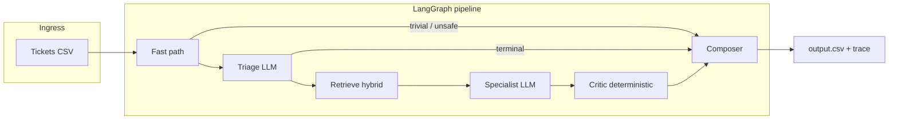

# Multi-domain corpus-grounded support triage

End-to-end system I built that ingests support tickets, routes them across multiple product domains, retrieves evidence from a **local markdown knowledge base** (no live web calls for answers), and produces **grounded replies** or **escalations** with **traceable** decisions.

It is designed with the kind of structure you’d expect in a real internal tool: explicit workflow steps, observability, rate limiting, and an escape hatch when the documentation does not support a safe answer.

**Author:** G Karthik Koundinya · [github.com/G26karthik](https://github.com/G26karthik)

---

## What I implemented

| Area | What it does |
|------|----------------|
| **Orchestration** | **LangGraph** `StateGraph`: fast path → triage → retrieve → specialist → **programmatic critic** → composer. Each step is a named node with spans written to `code/runs/<timestamp>/`. |
| **Cost & latency** | Regex **fast path** avoids LLM calls for trivial inputs and obvious unsafe patterns. **One** structured **triage** call (safety + routing + retrieval query). **One specialist** call when answering from the corpus. **No LLM critic**—verification is deterministic. |
| **Retrieval** | **Hybrid** **BM25** + **dense embeddings** (`BAAI/bge-small-en-v1.5`), z-score fusion, optional **cross-encoder rerank** when scores are ambiguous. **Visa** uses the full small corpus in-context; **HackerRank** and **Claude** use top‑k chunks. |
| **Grounding** | Specialists must cite chunk IDs; the **critic** checks citations and matches “hard facts” (URLs, phone numbers, email, currency) against cited text. Failures **downgrade to escalation** with a safe customer message. |
| **LLM layer** | **Anthropic** by default (**Haiku** triage, **Sonnet** specialists), structured outputs via **tool use**. **Gemini** supported behind `HRO_BACKEND=gemini` for portability. Sliding-window **rate limiter** + retries on transient errors. |
| **I/O & evaluation** | **Click** CLI: `run`, `eval`, `rebuild-index`, `trace`. **Eval harness** runs the labelled sample and reports accuracy, confusion matrices, and latency summaries. |
| **Configuration** | Central thresholds and paths in `hro/config.py`; prompts in `prompts/`; product-area mapping in `hro/corpus/product_area_map.json`. Secrets **only** via environment / `.env` (see `code/.env.example`). |

---

## Architecture



Typical LLM usage: **0–2 calls per ticket** on the main paths (details in [`code/README.md`](./code/README.md)).

---

## Tech stack

| Layer | Choice |
|-------|--------|
| Language | Python 3.11+ |
| Orchestration | [LangGraph](https://github.com/langchain-ai/langgraph) |
| Schemas | Pydantic v2 |
| Embeddings | [sentence-transformers](https://www.sbert.net/) · local inference |
| Vector / index | NumPy shards + content-addressed manifest |
| Sparse retrieval | [rank-bm25](https://github.com/dorianbrown/rank_bm25) |
| Reranker | `mixedbread-ai/mxbai-rerank-xsmall-v1` (optional GPU) |
| LLM APIs | `anthropic`, `google-genai` |
| CLI | Click |

---

## Quick start

```bash
git clone https://github.com/G26karthik/HRO.git
cd HRO
python -m venv .venv
source .venv/bin/activate   # Windows: .venv\Scripts\activate
pip install -r code/requirements.txt
cp code/.env.example .env
# Set ANTHROPIC_API_KEY (and optionally GEMINI_API_KEY if using Gemini)
python code/main.py rebuild-index   # first run or after corpus changes
python code/main.py run             # → support_tickets/output.csv + run trace
```

```bash
python code/main.py eval            # labelled sample, metrics report
python code/main.py trace --run latest
```

More layout and knobs: [`code/README.md`](./code/README.md). Deeper design notes: [`Summarizer.md`](./Summarizer.md).

---

## Repository layout

```text
.
├── README.md
├── Summarizer.md
├── LICENSE
├── code/
│   ├── main.py
│   ├── hro/           # graph, agents, index, llm, corpus, eval, …
│   ├── prompts/
│   └── requirements.txt
├── data/              # markdown corpus (per domain)
├── support_tickets/   # input CSVs (generate output.csv locally; not in git)
├── problem_statement.md
└── AGENTS.md
```

Runtime artifacts (gitignored): `data/index/`, `code/runs/`, `support_tickets/output.csv`.

---

## Production-oriented notes

- **Scale-out:** Workers can stay stateless; move index shards to shared storage and fan out tickets by domain or shard key.
- **Cache invalidation:** `CHUNKER_VERSION` / `EMBEDDER_VERSION` in `hro/config.py` bump when chunking or embedding logic changes.
- **Observability:** Today’s JSONL traces can be bridged to OpenTelemetry without changing the graph shape.
- **Risk:** Escalation + critic are deliberate guardrails against unsupported claims in regulated-style support.

---

## Corpus note

The **markdown tree under `data/`** shipped with the original hackathon starter I used as a base dataset; **all application code under `code/`**, prompts, indexing, graph, and tooling here are **my implementation** on top of that material.

---

## License

MIT — [`LICENSE`](./LICENSE). Content in `data/` remains subject to the respective vendors’ terms; use and redistribution of those documents are your responsibility.
