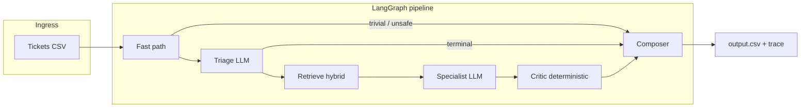

# Multi-domain corpus-grounded support triage

A **production-oriented reference implementation** of a multi-tenant support triage agent: it reads unstructured tickets, routes them across independent **knowledge domains**, retrieves evidence from a **local markdown corpus** (no live web calls for answers), and answers or escalates with **audit-friendly** traces.

Originally shipped as a high-intensity sprint; this repository is maintained as a **portfolio / reusable baseline** for teams who need **grounded** LLM replies over **internal help centers** or **exported vendor docs**—the same patterns apply to internal runbooks, policy libraries, and gated SaaS help content.

**Suggested display name for the repo:** `grounded-support-triage` or `corpus-triage-engine` (GitHub slug is optional; current clone: [`G26karthik/HRO`](https://github.com/G26karthik/HRO)).

---

## What you get

| Capability | Detail |
|------------|--------|
| **Grounding** | Answers constrained to retrieved chunks from `data/`; programmatic critic for citations + “hard facts” (URLs, phones, money). |
| **Safety & cost** | Regex fast-path → **0** LLM calls for trivial/malicious patterns; combined safety+triage in **1** call; specialists only when needed. |
| **Multi-tenant** | Per-company corpora (here: HackerRank, Claude, Visa) with shared orchestration code. |
| **Retrieval** | Hybrid **BM25 + dense** (BGE-small), z-score fusion, **conditional** cross-encoder rerank; Visa uses **full-corpus-in-prompt** (small KB). |
| **Orchestration** | **LangGraph** `StateGraph`—named nodes, explicit branches, replayable `trace.jsonl` per run. |
| **Providers** | **Anthropic** (default: Haiku triage, Sonnet specialists) with **Gemini** pluggable via `HRO_BACKEND=gemini`. |
| **Ops** | Env-only secrets, sliding-window rate limiter, async batch runner with bounded concurrency. |

---

## Architecture



**LLM calls per ticket:** typically **0–2** on the hot path (see `code/README.md`).

---

## Tech stack

| Layer | Choice |
|-------|--------|
| Language | Python 3.11+ |
| Orchestration | [LangGraph](https://github.com/langchain-ai/langgraph) |
| Schemas | Pydantic v2 |
| Embeddings | [sentence-transformers](https://www.sbert.net/) `BAAI/bge-small-en-v1.5` (local, no embedding API) |
| Dense index | NumPy shards + manifest-based cache invalidation |
| Sparse retrieval | [rank-bm25](https://github.com/dorianbrown/rank_bm25) |
| Reranker | `mixedbread-ai/mxbai-rerank-xsmall-v1` (optional GPU) |
| LLM APIs | `anthropic`, `google-genai` (structured output / tool use) |
| CLI | Click |

---

## Quick start

```bash
git clone https://github.com/G26karthik/HRO.git
cd HRO
python -m venv .venv
source .venv/bin/activate   # Windows: .venv\Scripts\activate
pip install -r code/requirements.txt
cp code/.env.example .env   # or place .env at repo root or under code/
# Edit .env: ANTHROPIC_API_KEY=...
python code/main.py run     # writes support_tickets/output.csv + code/runs/<ts>/
```

**Evaluate** against the small labelled sample (confusion matrices + accuracy):

```bash
python code/main.py eval
```

**Rebuild** the retrieval index after corpus changes:

```bash
python code/main.py rebuild-index
```

Details, layout, and tuning knobs: [`code/README.md`](./code/README.md).

---

## Configuration & secrets

- **Never commit `.env`.** Use `code/.env.example` as a template.
- Keys are read with layered `python-dotenv` loading (`repo/.env`, `code/.env`, cwd)—see `hro/llm/client.py`.
- Switch provider: `HRO_BACKEND=anthropic` (default) or `HRO_BACKEND=gemini`.

---

## Repository layout

```text
.
├── README.md                 # This file (portfolio entry)
├── Summarizer.md             # Long-form narrative / interview notes
├── code/                     # Application package + CLI
│   ├── main.py
│   ├── hro/                  # graph, agents, index, llm, corpus, eval
│   ├── prompts/              # Markdown prompts + few-shots
│   └── requirements.txt
├── data/                     # Versioned markdown corpus (per vendor tree)
├── support_tickets/          # sample + unlabelled CSVs (generate output locally)
├── problem_statement.md      # Original problem spec (historical)
└── AGENTS.md                 # Tooling contract from starter (AI agents)
```

Generated at runtime (gitignored): `data/index/`, `code/runs/`, `support_tickets/output.csv`.

---

## Scaling & enterprise considerations

- **Horizontal scaling:** Stateless workers + shared object store for shards (replace local `data/index/` with S3/GCS + mmap or on-demand loading); partition tickets by `company` or shard key.
- **Corpus updates:** Bump `CHUNKER_VERSION` / `EMBEDDER_VERSION` in `hro/config.py` when algorithms change so caches invalidate deterministically.
- **Observability:** Spans are JSON-serializable today—swap `code/runs/` for OpenTelemetry export without changing graph topology.
- **Governance:** Critic + escalation path reduces “helpful hallucination” risk; stricter orgs can add policy classifiers or human-in-the-loop queues on `escalated` rows.

---

## History & attribution

The **folder structure and corpus** descend from the **HackerRank Orchestrate** May 2026 starter (`problem_statement.md`, `AGENTS.md`). The **implementation in `code/`** is original application engineering on top of that corpus: LangGraph graph, hybrid retrieval, critic, and dual LLM backend.

Use the corpus **for research, education, and portfolio demonstration** consistent with the original challenge terms. This repo is **not** an official HackerRank or vendor product.

---

## Suggested rename for GitHub

If you want the slug to match the positioning:

| Slug | Rationale |
|------|-----------|
| `grounded-support-triage` | Describes behavior; searchable. |
| `corpus-triage-langgraph` | Keywords for recruiters. |
| `HRO` | Short; rename later when the project has a product name. |

---

## License

MIT — see [`LICENSE`](./LICENSE). Third-party markdown in `data/` remains under respective vendors’ terms; this project does not grant rights to redistribute those docs for commercial scraping beyond your own compliance review.
